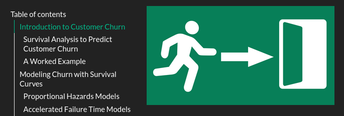

# Demo, Quarto

HTML report on a statistical technique. Right click to: <a href="https://ugolabo.github.io/demo_quarto_report_tufte_html_churn/" target="_blank">site</a>. 
This is the 'index.html' file.

**Survival analysis** encompasses techniques used across various fields, including medicine, engineering and sociology. These methods allow for estimating patient survival following treatment, predicting the lifespan of equipment for preventive maintenance or analyzing the time until reoffending to refine social reintegration policies. In marketing, survival analysis is specifically used to estimate **customer churn**:

- What is Customer Churn
- Survival Analysis to Predict Customer Churn
    - Proportional Hazards Models like the Weibull PH model
    - Accelerated Failure Time Models like the Weibull AFT model
- Survival Regression to Predict Customer Churn
    - Proportional Hazards Assumption and the Cox PH model 
